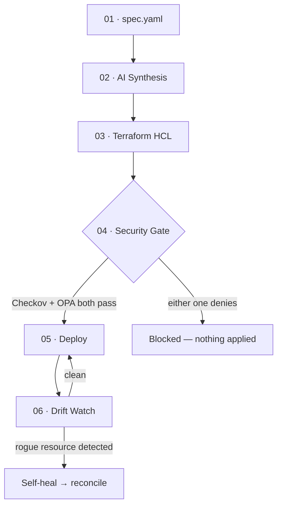

# SDD-Infra

**Specification-Driven Infrastructure Management.** You write a YAML spec. An AI layer compiles it into Terraform. Two independent, deterministic systems — a static security scanner and a policy engine — decide whether it's allowed to deploy. Neither the AI nor any single check gets the final say.

🌐 **Live demo**: [ai-infra-six.vercel.app](https://ai-infra-six.vercel.app/)  
🔌 **API**: [sdd-infra.onrender.com](https://sdd-infra.onrender.com/)

---

## The core idea

Most "AI generates your Terraform" tools stop at generation. That's the easy 80% — and it's also the part a 2026 benchmark study found only 3 of 7 evaluated LLMs could do safely by default. SDD-Infra treats AI-generated infrastructure the way it should be treated: as an unverified proposal, not an instruction.

> **AI proposes. → Deterministic systems decide. → Nothing applies until both agree.**

Concretely, that means every spec goes through six stages, and stages 4 and 5 are hard gates — not warnings, not confirmations, actual stops:



---

## What makes this different from "LLM writes Terraform"

- **The AI never writes Terraform directly.** It fills a strict JSON schema (resource type, replicas, image, tags). A deterministic Python renderer — no model involved — turns that into HCL. This is what makes the output testable instead of just "probably fine."
- **Self-correcting, not single-shot.** If the model's first output fails schema validation, the exact error is fed back into one retry before falling back to a deterministic offline compiler. No silent best-effort application of broken output.
- **Two independent gates, not one.** A static scanner (Checkov) and an OPA/Rego policy engine evaluate the plan separately. Either can block a deploy on its own.
- **Drift isn't a button, it's a loop.** A scheduled job compares live state against the spec every 10 minutes and can self-heal unmanaged resources automatically — the same code path whether it's triggered by the cron or a manual check.
- **Honest about its own limits.** The hosted demo has no Docker daemon and no cloud credentials — by design, since a public URL should never hold write access to real infrastructure. It stops cleanly at the security gate and says so, rather than faking a deploy. Full apply + drift reconciliation runs via the local CLI, and on every merge to main in CI, where a real Docker daemon is actually available.

---

## Targets

One spec compiles to any of three targets without rewriting it:

| Target | What gets generated | Can apply on hosted demo? | Can apply via CLI/CI? |
| :--- | :--- | :--- | :--- |
| `docker` | `docker_container`, `docker_image` | No — no daemon on the host | **Yes** |
| `aws_ecs` | ECS cluster, task definition, service, security groups | No — no credentials by design | **Only with your own AWS creds** |
| `kubernetes` | Deployment, service, namespace | No — no credentials by design | **Only with your own kubeconfig** |

---

## Security gate

### Layer 1 — Checkov (static AST scan)
- `CKV_DOCKER_1`: container not exposed to public ingress
- `CKV_DOCKER_2`: SSH (port 22) not exposed on workload containers

### Layer 2 — OPA / Rego (policy evaluation on the plan)
- `deny_public_access`: `public_access` must be `false`
- `deny_ssh_enabled`: `ssh` must not be enabled
- `deny_missing_owner`: every resource must carry an `owner` tag

All three OPA rules and both Checkov checks are toggleable per-run from the CLI or the dashboard's policy sandbox, for testing how a spec behaves under different guardrails.

---

## CLI

```bash
sdd validate specification/infrastructure.yaml           # schema + secret scan only
sdd compile specification/infrastructure.yaml            # spec → resource plan → HCL
sdd plan specification/infrastructure.yaml --target docker --json
sdd deploy specification/infrastructure.yaml --target docker --yes
sdd drift --reconcile                                   # check + self-heal
sdd history --limit 20                                  # recent runs, from Turso
```

Every command exits non-zero on any real failure — denial, validation error, drift found and unreconciled — so they compose directly into CI, which is exactly how `.github/workflows/pipeline.yml` uses them: **`validate` → `plan`** on every PR, **`deploy --target docker`** (real apply, real teardown) on every merge to main.

---

## Running it locally

```bash
git clone https://github.com/dumbspin/ai_infra.git
cd ai_infra
pip install -r requirements.txt
cp .env.example .env # fill in OPENROUTER_API_KEY at minimum
python -m src.cli validate specification/infrastructure.yaml
```

Full environment variables, Turso setup, and Docker/Render deploy steps are in [DEPLOY.md](DEPLOY.md).

---

## Stack

| Layer | Tech |
| :--- | :--- |
| **AI synthesis** | OpenRouter (free-tier models, configurable), deterministic offline fallback |
| **IaC** | Terraform, rendered from a validated JSON resource plan |
| **Security** | Checkov (static), Open Policy Agent / Rego (policy) |
| **Backend** | FastAPI, deployed on Render |
| **Frontend** | React + Vite + Tailwind, deployed on Vercel |
| **Persistence** | Turso (libSQL) — survives redeploys, unlike a local SQLite file would |
| **CI/CD** | GitHub Actions — validate on PR, real Docker apply + teardown on merge |
| **Tests** | **51/51 passing** — loader, compiler/renderer, CLI, policy evaluation, drift detection, reconciliation, FastAPI endpoints |

---

## Architecture deep-dive

The full PRD — including the schema design, the retry-with-feedback loop's exact failure handling, drift classification logic, and the reasoning behind every target decision — is in [docs/PRD.md](docs/PRD.md).

---

Built by [Ayush Dwivedi](https://github.com/dumbspin). Questions: [ask here](mailto:dwivediayush9634@gmail.com?subject=Question%20about%20SDD-Infra)
